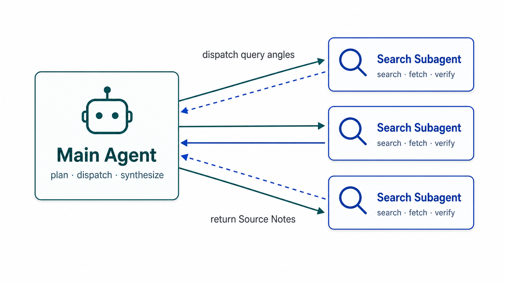

# Mini Search Agent

A Search Agent for answering open Research Questions with real web search, direct fetched evidence, durable Source Notes, and telemetry.

## Send Your Agent for a Quick Start

```
Read this guidance：
https://raw.githubusercontent.com/zzekelan/mini-search-agent/main/docs/quick-start/quick-start.md
```

## Install

Install uv first if it is not already available, then sync the project:

```bash
uv sync
```

## Run The Demo

Run the CLI with one open Research Question:

```bash
uv run mini-search-agent "RAG 中 hybrid retrieval + reranking 相比单纯 dense retrieval 的收益和局限是什么？"
```

The final answer is printed to stdout. Runtime artifacts are written under `.msa/`.

## Environment

The LLM provider is configured with OpenAI-compatible environment variables. Values in the shell override values in `.env`.

```bash
LLM_PROVIDER=openai-compatible
LLM_API_KEY=...
LLM_MODEL=deepseek-v4-flash
LLM_BASE_URL=https://api.deepseek.com
```

Web search uses Exa through the public MCP endpoint at `https://mcp.exa.ai/mcp`. This MVP does not require an Exa API key.

## System Design

<p align="center">
  
</p>

The Main Agent receives the Research Question, loads its prompt and form a Query Plan, dispatch multiple Search Subagents, consolidate Source Notes, and produce a final answer with `[W001]` citations.

Search Subagents run in isolated Sub-sessions. They load their own system prompt and receive only `web_search` and `web_fetch`. Their final response runs in JSON response mode and is parsed with a Pydantic schema before Source Notes are recorded.

The tool set is intentionally small:

- `web_search`: provider-neutral tool backed by Exa MCP.
- `web_fetch`: direct URL fetch and readable text extraction.
- `subagent`: starts a Search Subagent in a child session.
- `shell`: MainAgent-only shell access.

Source artifacts are stored under `.msa/research/<topic>/sources/`. Only source notes and the source index are research artifacts. Final answers are printed to stdout and recorded in the Session Timeline, not written as research artifacts.

Session history is stored under `.msa/sessions/session-YYYY-MM-DD-00x/`. The Main Agent timeline is `main.jsonl`; each child Sub-session has its own `timeline.jsonl`.

## Telemetry

Each session writes `.msa/sessions/<session>/telemetry.jsonl`. 

Useful checks:

```bash
jq -r '.event' .msa/sessions/session-YYYY-MM-DD-00x/telemetry.jsonl
```

Expected real-path signals include:

- `llm.request.started` and `llm.response.finished`
- `subagent.started` and `subagent.completed`
- `tool.web_search.started` and `tool.web_search.finished`
- `tool.web_fetch.started` and `tool.web_fetch.finished`
- `source_note.created` or `source_note.deduplicated`
- `final_answer.completed`
- `stdout.finalized`

The `final_answer.completed` event records cited source IDs, available source IDs, unknown citations, uncited available sources, and whether the answer included a Sources section.
